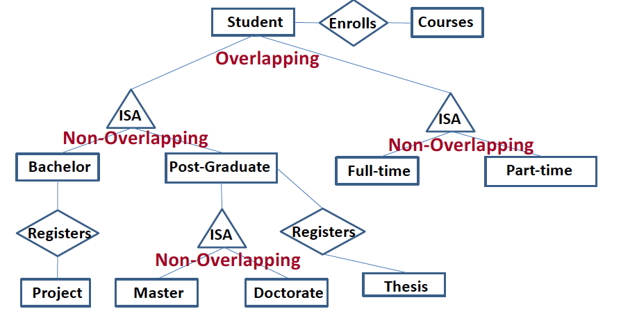

##Introduction to Database System
####2019
####Sophie Ammann
---------
###Lecture 1

#####1.1 Terminology :
* **Data** : facts, basis for reasoning, useful or irrelevant (only 10% of data is useful). Must be *processed* to be meaningful. "Everything that can be mathematicaly defined is data"
* **Information** : meaning, relevant to the problem
* **Database (DB)** : large, integrated, structured collection of data
* **Database Management System (DBMS)** : software system designed to store,
manage and facilitate access to databases (connected bridge btw user and database)
* **Data model** : collection of concepts for describing data (relational, hierarchical, graph,...)
* **Relational data model** : set of records represented by a table.

#####1.2 Relational data model
* **Relation** : table with row and columns
* **Schema** : Describes the structure (columns) of a relation

#####1.3 Logical and physical data independence
Data independence is the ability to change the schema at one level of the database system without changing the schema at the next higher level

* **Logical data independence** : capacity to change the conceptual schema without changing the user views
* **Physical data independence** : capacity to change the internal schema without having to change the conceptual schema or user views

---------
###Lecture 2 : ER model
#####2.1 Conceptual design
ER model = entity-relationship model  
* **Entity** : real-world object, distinguishable from other objects.  
**Attributes** are used to describe an entity. (defined in a domain)
* **Entity set** : A collection of similar entities. E.g., all employees 
**Key** : each entity set has a key
* **Relationship** : association between entities, can have their own attributes.
#####2.2 Constraints
######2.2.1 Key constraints

* Many-to-many :  
an employee can work in many departments; a department can have many employees

* One-to-many :  
each department has at most one manager

* One-to-one :  
each driver can drive at most one vehicle and each vehicle will have at most one driver.

######2.2.2 Participation constraints

* Total participation :  
Every employee should work in
at least one department. 
Every department should have
at least one employee.

* Participation + key constraint : 
There could be some employees
who are not managers. 
Every department should have at
least one manager.

* Partial participation :  
There could be some customers
who do not buy any products.  
There could be some products
which are not bought by any
customers. 

#####2.3 Weak entities
Entity that can be identified uniquely only by considering the primary key of another entity (owner).

There has to be a one-to-many relationship (one owner, many weak entities). 
The weak entity set must have total participation

#####2.4 Ternary relationships

#####2.5 ISA ('is a') hierarchies
Attributes inherited

######2.5.1 **Constraints** :
* **Overlap cosntraints** :
*Can a student be a master as well as a doctorate entity? (Allowed/Disallowed)*
* **Covering constraints** : *Does every Employees entity also have to be an Hourly_Emps or a Contract_Emps entity? (Yes/No)*

#####2.6 Aggregation :
Can treat a relationship set as an entity set.

---------
###Lecture 3 : Data model
