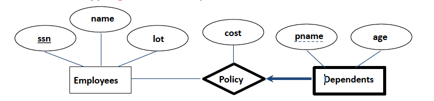

##Introduction to Database System
####2019
####Sophie Ammann
---------
###Lecture 1

#####1.1 Terminology :
* **Data** : facts, basis for reasoning, useful or irrelevant (only 10% of data is useful). Must be *processed* to be meaningful. "Everything that can be mathematicaly defined is data"
* **Information** : meaning, relevant to the problem
* **Database (DB)** : large, integrated, structured collection of data
* **Database Management System (DBMS)** : software system designed to store,
manage and facilitate access to databases (connected bridge btw user and database)
* **Data model** : collection of concepts for describing data (relational, hierarchical, graph,...)
* **Relational data model** : set of records represented by a table.

#####1.2 Relational data model
* **Relation** : table with row and columns
* **Schema** : Describes the structure (columns) of a relation

#####1.3 Logical and physical data independence
Data independence is the ability to change the schema at one level of the database system without changing the schema at the next higher level

* **Logical data independence** : capacity to change the conceptual schema without changing the user views
* **Physical data independence** : capacity to change the internal schema without having to change the conceptual schema or user views

---------
###Lecture 2 : ER model
#####2.1 Conceptual design
ER model = entity-relationship model  
* **Entity** : real-world object, distinguishable from other objects.  
**Attributes** are used to describe an entity. (defined in a domain)
* **Entity set** : A collection of similar entities. E.g., all employees 
**Key** : each entity set has a key
* **Relationship** : association between entities, can have their own attributes.
#####2.2 Constraints
######2.2.1 Key constraints

* Many-to-many :  
an employee can work in many departments; a department can have many employees

* One-to-many :  
each department has at most one manager

* One-to-one :  
each driver can drive at most one vehicle and each vehicle will have at most one driver.

######2.2.2 Participation constraints

* Total participation :  
Every employee should work in
at least one department. 
Every department should have
at least one employee.

* Participation + key constraint : 
There could be some employees
who are not managers. 
Every department should have at
least one manager.

* Partial participation :  
There could be some customers
who do not buy any products.  
There could be some products
which are not bought by any
customers. 

#####2.3 Weak entities
Entity that can be identified uniquely only by considering the primary key of another entity (owner).

There has to be a one-to-many relationship (one owner, many weak entities). 
The weak entity set must have total participation

#####2.4 Ternary relationships

#####2.5 ISA ('is a') hierarchies
Attributes inherited

######2.5.1 **Constraints** :
* **Overlap cosntraints** :
*Can a student be a master as well as a doctorate entity? (Allowed/Disallowed)*
* **Covering constraints** : *Does every Employees entity also have to be an Hourly_Emps or a Contract_Emps entity? (Yes/No)*

#####2.6 Aggregation :
Can treat a relationship set as an entity set.

---------
###Lecture 3 : Data model
**SQL** = Structured Query Language
#####3.1 Creating relations in SQL

#####3.2 Key
* **superkey** :  
Set of attributes for which no two distinct tuples can have same values in all key fields . Can be all the attributes, or just a few.
* **key** : 
 minimal superkey (no subset of the fields is a superkey)
* **candidate key** : 
 if there are multiple keys, then each of them is referred to as candidate key
* **primary key** :  
one of the candidate key is chosen

*Example :*

* *UNIQUE* keyword indicates a candidate key that is not the primary key.
* *PRIMARY* keyword indicates the primary key.

#####3.3 Integrity constraints (ICs)
* **IC** = condition that must be true for any instance of the database (the domain constraints) 
* **legal instance** : satisfies all the specified ICs. 
//TODO ...

---------
###Lecture 4 : Relational algebra
#####4.1 Introduction
relation algebra = operational, useful for representing execution plans  
* query is applied to *relation instances*, the result is also a *relation instance*.
* Schema of the input relations for a query is **fixed** (but query will run over any legal instance)
* Schema of output (result) of a given query is also **fixed**

#####4.2 Basic operations
* **selection** $\sigma$ : 
  selects *rows* from a relation (horizontal)  
  $\leftrightarrow$ *WHERE* in SQL

  *example :*
  

* **projection** $\pi$ :  
  retains only wanted *columns* from a relation (vertical)  
  $\leftrightarrow$ *SELECT* in SQL

  *example :*
  
* **cross-product** $\times$ : 
  combines two relations

  *example :*
  

* **set-difference** $-$ :  
  tuples in $R_1$ but not in $R_2$ 

  $R_1$ and $R_2$ must be *union compatible* (same number of fields and fields of same type)

  *example :*
  

* **union** $\cup$ :  
  tuples in $R_1$ and/or in $R_2$ 

  $R_1$ and $R_2$ must be *union compatible* (same number of fields and fields of same type)

  *example :*
  

#####4.3 Renaming operator $\rho$
renames the list of attributes : 
$<oldname> \longrightarrow <newname>$ 
or 
$<position> \longrightarrow <newname>$ , where *position* starts at 1!

*example :*

#####4.4 Compound operators
######4.4.1 Natural join $\Join$
*idea* :  
* compute $R \times S$
* select rows where attributes that appear in both relations have equal values
* project all unique attributes and one copy of the common ones  

*example :*

######4.4.2 Condition join or theta-join $\Join_c$

$R\Join_c S = \sigma_c (R \times S)$

######4.4.3 Equi-join
special case of the theta-join : condition *c* contains only conjunction of equality conditions 

*example :* 
good way of finding all pairs of sailors in $S_1\times S_2$ who have the same age :  
$$
  \sigma_{sid_1 < sid_2}(S_1 \Join_{age = age_2}\rho _{age \rightarrow age2, sid \rightarrow sid2}(S_2))
$$

######4.4.3 Division
$A/B$ contains all $x$ tuples such that for every tuple in $B$, there is an $(x,y)$ tuple in $A$. 
($B$ is a proper subset of $A$)

---------
###Lecture 5 : Storage, files and indexing
#####5.1 Introduction
file and access layer :
* retrieve one particular record (using record id) : **point access**
* retrieve a range of records (satisfying some conditions) : **range access**
* retrieve all records : **scan**

#####5.2 N-ary storage model (flash page)

* **page** : collection of slots
* **slot** : one record
* **rid** : record id = <page id, slot#>, should be unique
#####5.3 PAX
**PAX** = partition attributes across

#####5.3 Indexing

* an **index** :  
An index is a data structure that organizes data records on disk to optimize certain kinds of retrieval operations. An index allows us to efficiently retrieve all records that satisfy search conditions on the search key fields of the index.
* a **key** :  
indexing field
* a **data entry** : 
refers to the records stored in an index file. 
A data entry with search key value $k$, denoted as $k*$, contains enough information to locate (one or more) data records with search key value $k$.

######5.3.1 Data entry representation
three alternative representations with search key value $k$ :
1) data entry with $k*$ is an actual data record

*(image : Alt. 1, hash-based indexing)* 
At most one index can use Alt. 1. Efficient but can be expensive to maintain (insertions and deletion modify the data file)
2) data entry is a $(k, rid)$ pair
3) data entry is a $(k, rid-list)$ pair

*(image : Alt. 2, hash-based indexing)* 

Notes : 
Alt. 2 and Alt. 3, which contain data entries that point to data records, are independent of the file organization that is used for the indexed file.  
Easier to maintain than Alt. 1.

######5.3.2 Primary and secondary indexes
* **primary index** : index on a set of fields that includes the primary key
* **secondary index** : all the other indexes
* *Note* : a primary index is guaranteed not to contain duplicates, but an index on other (collections of) fields can contain duplicates.

######5.3.3 Clustering

* **clustered index** : index whose data entries are sorted and ordered the same way as the file records. One index entry per distinct value, sparse index
* **unclustered index** : not the same sorting

######5.3.4 Dense vs Sparse
* **dense** : at least one entry per key value  
Alt. 1 is a dense indexing
* **sparse** : an entry

* **summary** :

######5.3.5 Index data structure
1) hash-based indexing :
    - hash function:
      $$
        r = record  \\
        h(r.searchKey) = bucket \ for \ record \ r
      $$
    - the records in a file are grouped in **buckets**, where a bucket consists of a **primary page** and, possibly, additional pages linked in a chain.
    - The bucket to which a record belongs can be determined by applying a special function, called a *hash* function, to the search key.

2) tree-based indexing :
      - The data entries are arranged in sorted order by search key value, and a hierarchical search data structure is maintained that directs searches to the correct page of data entries.
      - The **leaf level** (lowest level on the tree) contains the data entries.
      - The average number of children for a non-leaf node is called the **fan-out**
      - A **B+ tree** is a tree where all leafs have equal height
