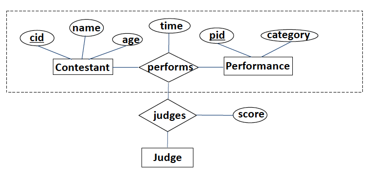

##Introduction to Database System
####2019
####Sophie Ammann
---------
###Lecture 1

#####1.1 Terminology :
* **Data** : facts, basis for reasoning, useful or irrelevant (only 10% of data is useful). Must be *processed* to be meaningful. "Everything that can be mathematicaly defined is data"
* **Information** : meaning, relevant to the problem
* **Database (DB)** : large, integrated, structured collection of data
* **Database Management System (DBMS)** : software system designed to store,
manage and facilitate access to databases (connected bridge btw user and database)
* **Data model** : collection of concepts for describing data (relational, hierarchical, graph,...)
* **Relational data model** : set of records represented by a table.

#####1.2 Relational data model
* **Relation** : table with row and columns
* **Schema** : Describes the structure (columns) of a relation

#####1.3 Logical and physical data independence
Data independence is the ability to change the schema at one level of the database system without changing the schema at the next higher level

* **Logical data independence** : capacity to change the conceptual schema without changing the user views
* **Physical data independence** : capacity to change the internal schema without having to change the conceptual schema or user views

---------
###Lecture 2 : ER model
#####2.1 Conceptual design
ER model = entity-relationship model  
* **Entity** : real-world object, distinguishable from other objects.  
**Attributes** are used to describe an entity. (defined in a domain)
* **Entity set** : A collection of similar entities. E.g., all employees 
**Key** : each entity set has a key
* **Relationship** : association between entities, can have their own attributes.
#####2.2 Constraints
######2.2.1 Key constraints

* Many-to-many :  
an employee can work in many departments; a department can have many employees

* One-to-many :  
each department has at most one manager

* One-to-one :  
each driver can drive at most one vehicle and each vehicle will have at most one driver.

######2.2.2 Participation constraints

* Total participation :  
Every employee should work in
at least one department. 
Every department should have
at least one employee.

* Participation + key constraint : 
There could be some employees
who are not managers. 
Every department should have at
least one manager.

* Partial participation :  
There could be some customers
who do not buy any products.  
There could be some products
which are not bought by any
customers. 

#####2.3 Weak entities
Entity that can be identified uniquely only by considering the primary key of another entity (owner).

There has to be a one-to-many relationship (one owner, many weak entities). 
The weak entity set must have total participation

#####2.4 Ternary relationships

#####2.5 ISA ('is a') hierarchies
Attributes inherited

######2.5.1 **Constraints** :
* **Overlap cosntraints** :
*Can a student be a master as well as a doctorate entity? (Allowed/Disallowed)*
* **Covering constraints** : *Does every Employees entity also have to be an Hourly_Emps or a Contract_Emps entity? (Yes/No)*

#####2.6 Aggregation :
Can treat a relationship set as an entity set.

---------
###Lecture 3 : Data model
**SQL** = Structured Query Language
#####3.1 Creating relations in SQL

#####3.2 Key
* **superkey** :  
Set of attributes for which no two distinct tuples can have same values in all key fields . Can be all the attributes, or just a few.
* **key** : 
 minimal superkey (no subset of the fields is a superkey)
* **candidate key** : 
 if there are multiple keys, then each of them is referred to as candidate key
* **primary key** :  
one of the candidate key is chosen

*Example :*

* *UNIQUE* keyword indicates a candidate key that is not the primary key.
* *PRIMARY* keyword indicates the primary key.

#####3.3 Integrity constraints (ICs)
* **IC** = condition that must be true for any instance of the database (the domain constraints) 
* **legal instance** : satisfies all the specified ICs. 
//TODO ...

---------
###Lecture 4 : Relational algebra
#####4.1 Introduction
relation algebra = operational, useful for representing execution plans  
* query is applied to *relation instances*, the result is also a *relation instance*.
* Schema of the input relations for a query is **fixed** (but query will run over any legal instance)
* Schema of output (result) of a given query is also **fixed**

#####4.2 Basic operations
* **selection** $\sigma$ : 
  selects *rows* from a relation (horizontal)  
  $\leftrightarrow$ *WHERE* in SQL

  *example :*
  

* **projection** $\pi$ :  
  retains only wanted *columns* from a relation (vertical)  
  $\leftrightarrow$ *SELECT* in SQL

  *example :*
  
* **cross-product** $\times$ : 
  combines two relations

  *example :*
  

* **set-difference** $-$ :  
  tuples in $R_1$ but not in $R_2$ 

  $R_1$ and $R_2$ must be *union compatible* (same number of fields and fields of same type)

  *example :*
  

* **union** $\cup$ :  
  tuples in $R_1$ and/or in $R_2$ 

  $R_1$ and $R_2$ must be *union compatible* (same number of fields and fields of same type)

  *example :*
  

#####4.3 Renaming operator $\rho$
renames the list of attributes : 
$<oldname> \longrightarrow <newname>$ 
or 
$<position> \longrightarrow <newname>$ , where *position* starts at 1!

*example :*

#####4.4 Compound operators
######4.4.1 Natural join $\Join$
*idea* :  
* compute $R \times S$
* select rows where attributes that appear in both relations have equal values
* project all unique attributes and one copy of the common ones  

*example :*

######4.4.2 Condition join or theta-join $\Join_c$

$R\Join_c S = \sigma_c (R \times S)$

######4.4.3 Equi-join
special case of the theta-join : condition *c* contains only conjunction of equality conditions 

*example :* 
good way of finding all pairs of sailors in $S_1\times S_2$ who have the same age :  
$$
  \sigma_{sid_1 < sid_2}(S_1 \Join_{age = age_2}\rho _{age \rightarrow age2, sid \rightarrow sid2}(S_2))
$$

######4.4.3 Division
$A/B$ contains all $x$ tuples such that for every tuple in $B$, there is an $(x,y)$ tuple in $A$. 
($B$ is a proper subset of $A$)
